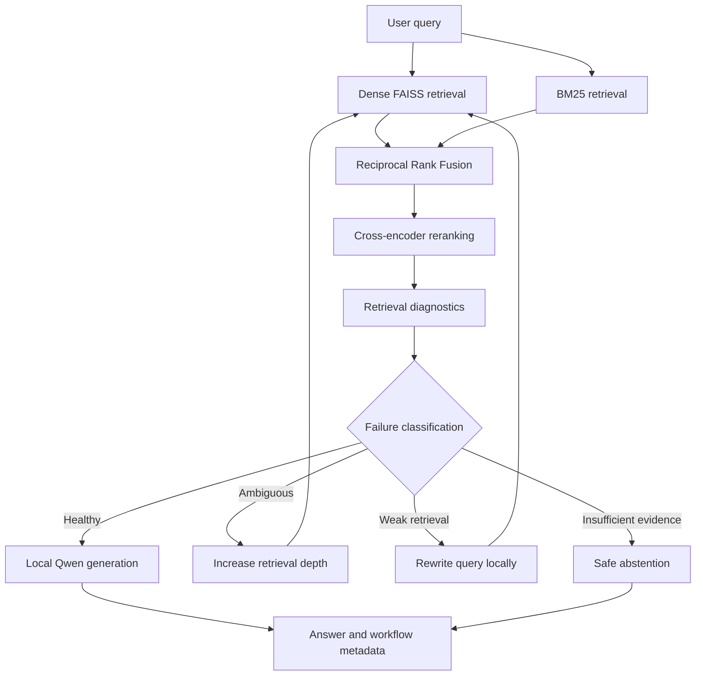

# Self-Healing RAG

[](https://github.com/Aaronuae86/self-healing-rag/actions/workflows/ci.yml)


A local, open-source Retrieval-Augmented Generation system that diagnoses retrieval quality before answering and applies a bounded recovery strategy when evidence is weak or ambiguous.

The project combines dense and sparse retrieval, reciprocal-rank fusion, cross-encoder reranking, retrieval diagnostics, failure classification, query rewriting, retrieval-depth expansion, safe abstention, grounded local generation, evaluation tooling, a FastAPI service, and Docker packaging. It uses no paid inference APIs, hosted vector databases, API keys, or billing accounts.

## Highlights

- **Self-healing control flow:** a LangGraph state machine classifies retrieval as `HEALTHY`, `AMBIGUOUS`, `WEAK_RETRIEVAL`, or `INSUFFICIENT_EVIDENCE`.
- **Targeted recovery:** ambiguous queries expand retrieval depth; weak retrieval triggers local Qwen query rewriting; insufficient evidence produces a controlled abstention.
- **Bounded execution:** recovery is limited by a configurable retry budget to prevent unbounded loops.
- **Hybrid retrieval:** SentenceTransformers and FAISS provide dense search, BM25 provides sparse search, and Reciprocal Rank Fusion combines both rankings.
- **Precision reranking:** a local cross-encoder reranks fused candidates before diagnostics and generation.
- **Traceable results:** the workflow retains failure classification, reasons, recovery action, retry count, retrieved evidence, and graph path.
- **Local generation:** Qwen2.5-1.5B-Instruct runs through Hugging Face Transformers and PyTorch.
- **Memory-aware API:** FastAPI initializes the heavyweight pipeline lazily on the first `/query` request and reuses it thereafter; `/health` never loads the models.
- **Container-ready:** the Docker image exposes Uvicorn on `0.0.0.0:8000` and supports a persistent Hugging Face cache volume.
- **Evaluation tooling:** controlled failure cases plus SQuAD-based retrieval, stress, and generation evaluation code track retrieval, answer, safety, groundedness, recovery, and latency metrics.

## Architecture



The retry path is bounded. When the retry budget is exhausted, the graph proceeds with the best available reranked evidence instead of looping indefinitely.

## Technology stack

| Area | Components |
|---|---|
| Orchestration | LangGraph |
| Generation and rewriting | Qwen2.5-1.5B-Instruct, Hugging Face Transformers, PyTorch |
| Dense retrieval | SentenceTransformers, FAISS cosine similarity |
| Sparse retrieval | BM25 |
| Fusion and reranking | Reciprocal Rank Fusion, cross-encoder reranker |
| API | FastAPI, Pydantic, Uvicorn |
| Packaging | Docker, Python 3.12 slim |
| Evaluation | SQuAD-style Exact Match and token F1, Recall@K, MRR, lexical and local-NLI groundedness, safe-refusal and unsupported-answer rates, recovery outcomes, component latency, p95 total latency |

## Repository layout

```text
.
|-- data/
|   |-- phase1_corpus.json          # Small controlled runtime corpus
|   `-- phase6_evaluation.json      # 25-case failure-aware evaluation set
|-- notebooks/                      # Progressive experiments and evaluation notebooks
|-- results/README.md               # Generated benchmark artifact documentation
|-- src/
|   |-- api.py                      # Lazy-loading FastAPI service
|   |-- evaluation/                 # Retrieval, stress, generation and groundedness evaluation
|   `-- rag/                        # Retrieval, diagnostics, failure detection and LangGraph workflow
|-- tests/                          # Model-free API and Docker contract tests
|-- Dockerfile
|-- requirements.txt
`-- README.md
```

Generated model weights, dataset caches, FAISS indexes, and benchmark outputs are deliberately excluded from Git.

## Requirements

- Python 3.12
- Git
- Approximately 10-12 GB of available RAM is recommended for comfortable CPU execution
- Several gigabytes of free disk space for Python packages and model caches
- Docker Desktop only if using the container workflow

The first real query may take several minutes because the embedding model, reranker, and Qwen model must be downloaded and loaded. CPU generation can also be slow. A 16 GB development machine should run the demo, but other memory-intensive applications should be closed during first load and inference.

## Local setup

### Windows PowerShell

```powershell
git clone https://github.com/Aaronuae86/self-healing-rag.git
Set-Location self-healing-rag

py -3.12 -m venv .venv
& .\.venv\Scripts\python.exe -m pip install --upgrade pip
& .\.venv\Scripts\python.exe -m pip install -r .\requirements.txt
```

Start the API:

```powershell
& .\.venv\Scripts\python.exe -m uvicorn src.api:app --host 127.0.0.1 --port 8000
```

### Linux or macOS

```bash
git clone https://github.com/Aaronuae86/self-healing-rag.git
cd self-healing-rag

python3.12 -m venv .venv
source .venv/bin/activate
python -m pip install --upgrade pip
python -m pip install -r requirements.txt
python -m uvicorn src.api:app --host 127.0.0.1 --port 8000
```

Open the interactive API documentation at <http://127.0.0.1:8000/docs>.

## API usage

### Health check

`GET /health` is intentionally lightweight and does not initialize any models.

```bash
curl http://127.0.0.1:8000/health
```

```json
{"status":"ok"}
```

### Query

The first request to `POST /query` initializes and caches the complete local workflow. Later requests reuse the same models and indexes.

```bash
curl -X POST "http://127.0.0.1:8000/query" \
  -H "Content-Type: application/json" \
  -d '{"query":"Where is the Mona Lisa displayed?"}'
```

The response contains the answer and control-flow metadata derived from the real LangGraph state:

```json
{
  "answer": "The Mona Lisa is displayed at the Louvre Museum in Paris.",
  "failure_type": "HEALTHY",
  "abstained": false,
  "recovery_action": "PROCEED_TO_GENERATION",
  "retry_count": 0,
  "graph_path": ["RETRIEVE", "RERANK", "DIAGNOSTICS", "HEALTHY", "GENERATE"],
  "rewritten_query": null,
  "classification_reasons": []
}
```

The answer text and classification reasons depend on local model output and retrieval diagnostics; the example shows the response shape.

## Docker

Build the image:

```bash
docker build -t self-healing-rag .
```

Run the API on port 8000:

```bash
docker run --name self-healing-rag-api -p 8000:8000 self-healing-rag
```

Persist Hugging Face downloads between containers:

```bash
docker volume create self-healing-rag-hf-cache
docker run --name self-healing-rag-api -p 8000:8000 \
  -v self-healing-rag-hf-cache:/cache/huggingface \
  self-healing-rag
```

Model weights are downloaded at first use and are not baked into the image.

## Evaluation

The repository contains evaluation code rather than published performance claims:

- `data/phase6_evaluation.json` defines 25 controlled healthy, ambiguous, weak-retrieval, and missing-evidence cases.
- `notebooks/06b_squad_retrieval_benchmark.ipynb` evaluates dense and hybrid retrieval with Recall@K and MRR.
- `notebooks/06c_squad_stress_benchmark.ipynb` covers paraphrases, hard distractors, detector calibration, failure labels, and recovery behavior.
- `notebooks/06d_squad_generation_evaluation.ipynb` evaluates answer quality, safe refusal, unsupported generation, lexical and local-NLI groundedness, recovery outcomes, and latency.

Generated benchmark outputs are ignored by Git because they are reproducible, environment-dependent, and may be large. No unverified benchmark score is claimed in this repository.

## Tests and continuous integration

Run the model-free checks without downloading or initializing heavyweight models:

```bash
python -m compileall -q src tests
python -m unittest discover -s tests -v
```

The tests cover:

- empty-query validation;
- workflow-state to API-response mapping;
- lightweight health checks;
- lazy one-time workflow initialization and reuse;
- Docker base image, runtime file selection, cache location, and Uvicorn binding;
- `.dockerignore` coverage for generated and local development artifacts.

GitHub Actions runs the same model-free checks on pushes and pull requests. The CI job intentionally installs only the lightweight packages required to import and test the API contract; it does not download model weights or run heavyweight inference.

## Design constraints

- Local and open-source components only
- No OpenAI, Anthropic, Cohere, or other paid inference APIs
- No hosted or paid vector database
- No API key or billing account required
- One Uvicorn worker is recommended for the local demo; multiple workers would each load a separate model stack
- The API serializes queries through a process-local lock because the cached model stack is shared

## Current scope

This is a development and portfolio implementation, not a managed production service. Authentication, rate limiting, distributed serving, monitoring, cloud deployment, and Kubernetes are intentionally outside the current phase. The Docker image and full heavyweight inference path should be validated on the target machine before presenting performance or production-readiness claims.

## Project progression

The notebooks preserve the implementation sequence:

1. Baseline dense RAG
2. Hybrid dense and sparse retrieval
3. Cross-encoder reranking
4. Retrieval diagnostics
5. Self-healing LangGraph workflow
6. Controlled and SQuAD-based evaluation tooling
7. FastAPI service
8. Docker packaging and model-free CI checks
